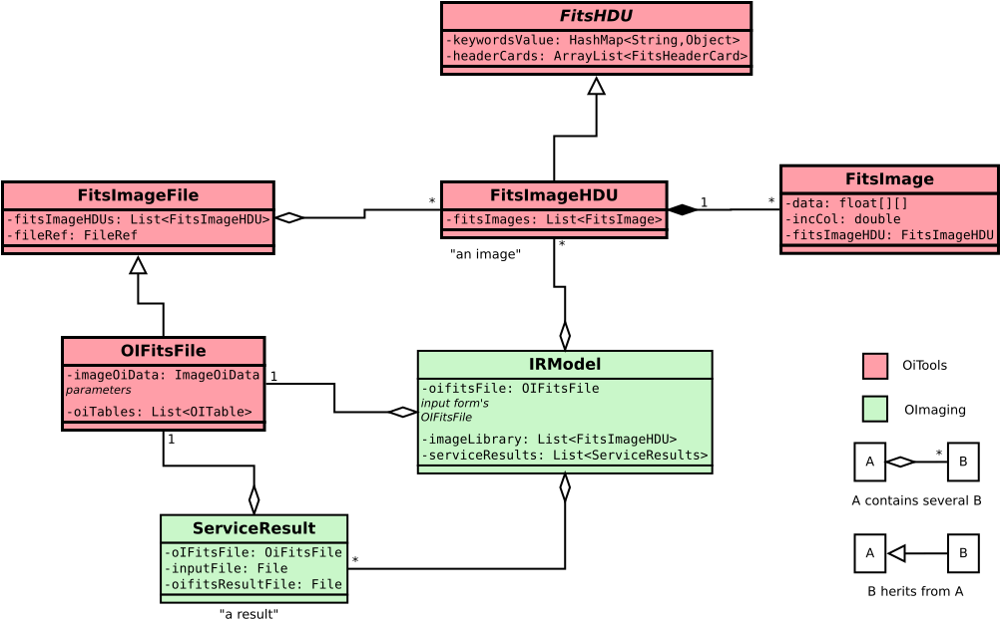

# OImaging Structures

In this document we go through some of the most important Java data structures used in OImaging. The goal is to be able to discuss OImaging development without needing to dive in the source code.

## FitsImageHDU

In a lot of cases it is correct to call this structure "an image".

A `FitsImageHDU` is a *Fits HDU* with *Header* and *Data* sections, with *image extension* (see [Fits guide](https://archive.stsci.edu/fits/users_guide/node41.html#SECTION00550000000000000000)).

It contains a list of `FitsImage`. This list often has only one element, that is why we call `FitsImageHDU` an "image". See section [`FitsImage`](#fitsimage) for more information about these.

It contains keywords, see section [`FitsHDU`](#fitshdu), since `FitsImageHDU` herits from it. An example is the keyword `HDU_NAME`.

Location: OiTools

## FitsHDU

This structure contains keywords and header cards. The difference between these two is that keywords have a description, see class `KeywordMeta`.

A keyword is identified by a `String` name. Its value can take one of the following types: `String`, `Double`, `Integer`, `Boolean`.

A header card has a `String` name and a `String` value. In practice the `String` value can be parsed as another type, but then you are supposed to declare it as a keyword.

Location: OiTools

## FitsImage

Contains the data of an image, by a two dimensions array of type float (4 octets).

Contains the meta-data of the image, by several fields, for example `incCol`, of type `double`, which stores the absolute coordinate increment along the column axis, in the metric radians by pixel.

You should note that this meta-data contains duplicate information with the keywords of the parent `FitsImageHDU`.
For example, the keyword `CRPIX1` and the field `pixRefCol` must always be equals.

A `FitsImage` always belong to exactly one `FitsImageHDU`. The field `fitsImageHDU` references the parent `FitsImageHDU`.

Location: OiTools

## OIFitsFile

An `OI Fits` file, but parsed as a Java Object. 

It does not have to be associated to an actual file on the disk, there is no mechanism of automatic synchronization. There is the class `OIFitsWriter` to parse an `OI Fits` file to an `OIFitsFile` object, and the class `OIFitsLoader` to export an `OIFitsFile` object to `OI Fits` file.

The OIFitsFile contains:

- herited from `FitsImageFile`:
  - the list of `FitsImageHDU`
- the input and output parameters
- the meta datas:
  - the targets
  - the OI arrays
  - the wavelengths
  - the correlations
  - the OI_INSPOL
- the datas:
  - the OIData
  - the VIS
  - the VIS2
  - the T3
  - the flux

Note that as the [OI FITS format description](https://github.com/JMMC-OpenDev/OI-Imaging-JRA/blob/master/doc/interface/OI-Interface.pdf) says, the input and output parameters of the reconstruction are not stored as keywords of images, but belong to their own *HDU*. In the Java object the reconstruction parameters HDUs are represented by the class `ImageOiParam`.

Location: OiTools

## ServiceResult

A `ServiceResult` is a result of a computation.

Consider that it is used in two different moments: before the computation takes places, and after the computation is completed.

Before the computation, the `ServiceResult` is filled with three file paths:

- the path of the *input file*, which will be the `OI Fits` file given as input to the algorithm.
- the path of the *result file*,  which will be the `OI Fits` file given as output by the algorithm.
- the path of the *execution log file*, which will contain the standard error output from the algorithm.

The current time is also recorded as `startTime`.

After the computation, when the `Add Result` action is called, the *result file* and *execution log file* are loaded from the disk and parsed in Java objects, references in the `ServiceResult` fields `oiFitsFile` and `executionLog`. The time is also recorded as `endTime`. The field `index` is filled.

Location: OImaging

## IRModel

This in the principal model (data structure) of OImaging. We can almost call it the "state of OImaging".

Principaly, it contains:

- the `OIFitsFile` associated to the input form. When you click on Run, it will be written to a file and given to the algorithm.
- the "image library" which is a list of `FitsImageHDU` that the user can select for initial images and regulation images.
- the list of `ServiceResult`, the results of previous computations.

You can also find some additional state, for example the `Boolean running` which tells if there is a current compilation. You have also some duplicated state like the `FitsImageHDU selectedInputImageHDU`. This information could be retrieved from the `OIFitsFile` associated to the input form, but it is practical as a shortcut.

Location: OImaging

