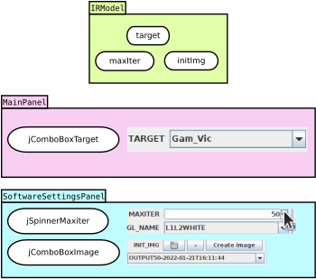
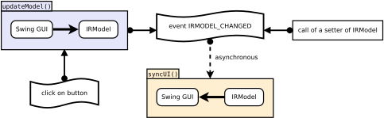
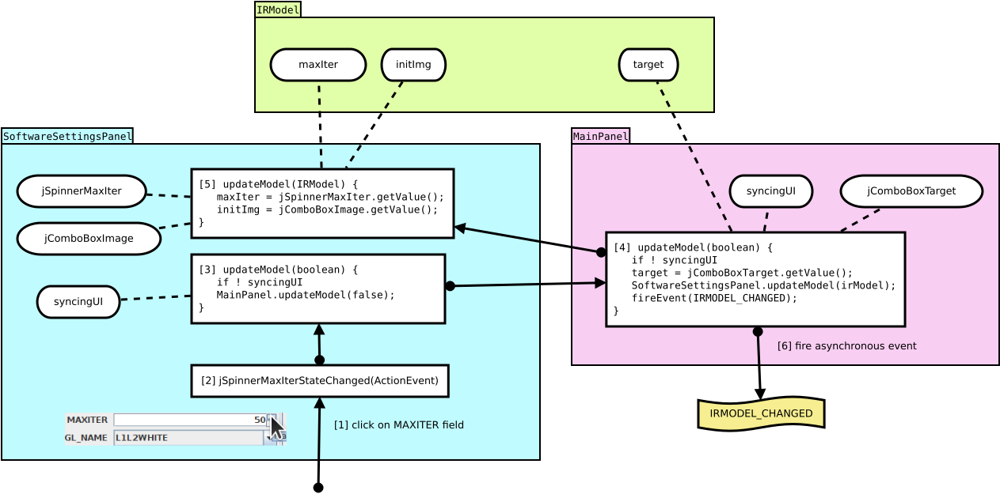
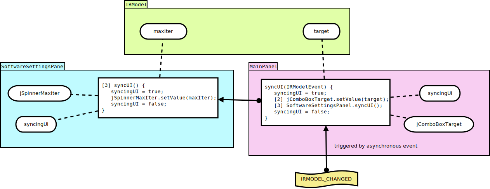

# Sequence on click

Here is what happen when you click on a button in OImaging.

## State in IRModel and Swing GUI panels

In OImaging there is a central state in the `IRModel` class.

But every Swing field, such as the list selector for initial images `jComboBoxImage`, has its own state. This state contains not only the list of selectable images, but also the currently selected image, and some other state needed for the list widget to work.

There is indeed a duplication of state between `IRModel` and the panels `MainPanel` and `SoftwareSettingsPanel`.

The benefit of having a central state is that it is easier to maintain its consistency. Also, it makes it easier to modify the state of OImaging, you just have to call *setters* of `IRModel`.

The drawback of having a duplication of state is that you must maintain synchronization between `IRModel` state and Swing GUI fields states. This is achieved by the two mechanisms *update model* and *sync UI*:

The mechanism *update model* reads the states of the Swing GUI panels and writes it to the `IRModel` state.

The mechanism *sync UI* reads the state of `IRModel` and writes it to the Swing GUI panels states. You will have observed that *sync UI* is triggered only by the reception of an asynchronous event. This permits to compress a bunch of calls to syncUI into a single one. Observe also that a call to a setter of `IRModel` must cast an event in order to see the GUI updated. It is not automatic, you must manually cast the event.

## Update Model

The `jSpinnerMaxIterStateChanged` function is the handler for value change of the field `jSpinnerMaxIter`. Clicking on the up arrow updates the value of `jSpinnerMaxIter`, which trigger the handler.

Understand that there is an arborescence of panels. Here `MainPanel` is the root and `SoftwareSettingsPanel` is its child. When you click on a button of `SoftwareSettingsPanel`, there is a *bottom up* mechanism to call the *root update model* function. Then the *update model* functions of the children are called. The mechanism ends by casting an event asking for *sync UI*.

Note that all fields are written to the `IRModel` state, not only the field where there was an event.

You will have noticed the presence of `syncingUI` state and conditions. These are explained in the *sync UI* section.

## Sync UI

Like *update model*, the mechanism *sync UI* starts with the *root panel*, and propagates to the children.

Note that we always surround the mechanism by setting `syncingUI` to `true`. Indeed, when we call setters on Swing GUI fields, it triggers their value change handlers, which triggers the *update model* mechanism. Here we do not need nor want to process *update model*, because we are currently making `IRModel` state and Swing GUI fields states identical. That is why the *update model* mechanism is aborted when `syncingUI` is `true`.

## Beware of events

When you modify `IRModel` state, for example by calling one of its setter, you finally cast an `IRMODEL_CHANGED` event. However, it can happen that another event has been triggered and will resolve *before* your `IRMODEL_CHANGED` event. It becomes a problem when that other event modify a Swing GUI field and thus call synchronously the *update model* mechanism. Here is what happen:

1. `IRModel.image` state is `"cat.png"`. Swing GUI image field state is `"cat.png"`.
2. Your code calls `IRModel.image.setValue("dog.png");`, making `IRModel.image` state becoming `"dog.png"`.
3. At the same time, some event occurs, let us call it `SOME_EVENT`.
4. Your code casts the event `IRMODEL_CHANGED`.
5. The event `SOME_EVENT` is handled, and synchronously calls *update model*.
6. The mechanism *update model* reads `"cat.png"` from Swing GUI image field state, and writes it to `IRModel.image` state.
7. Your event `IRMODEL_CHANGED` is handled, and synchronously calls *sync UI*. However it is now pointless because `"dog.png"` has been lost. 

Generally, make your handlers only call *update model* when some significant value update has occured.

