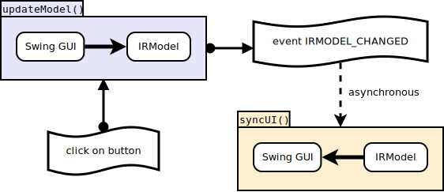

# Sequence of events when you click on a button

What is happening when you click on a button in OImaging ? Here is a scheme:

First the *update model* mechanism takes the values of the fields of the Swing GUI (i.e, the number in MAXITER field), and puts them in the `IRModel`, which is where the state of OImaging resides.

Then, the *sync UI* mechanism takes the values from the `IRModel`, and puts them in the Swing GUI.

The benefit to having a central state in `IRModel` is that it is easier to ensure its consistency. It is also easier to modify it without trouble to think about the GUI because *sync UI* will do it for you.\
The drawback is that you now have a duplication of state : the central state in `IRModel` and all the little states in the Swing GUI fields. The mechanisms *update model* and *sync UI* are here to make this synchronization simple.

## Update Model

Here is a scheme of the "up" mechanism:

`MainPanel` contains `SoftwareSettingsPanel`. When you click on a button, there is a first `updateModel(boolean)` function that climbs the tree of panels up to the root (here `MainPanel`).\
Then the actual `updateModel` takes place, you can see that the GUI fields like `jComboBoxTarget` and `jSpinnerMaxIter` are replaced with the values of the `IRModel`.

## Sync UI

Here is a scheme of the "down" mechanism:

